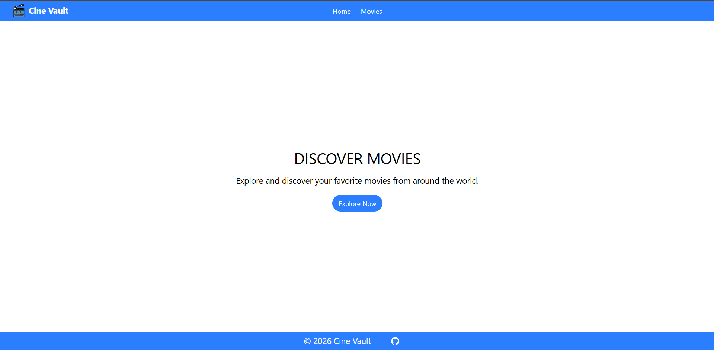
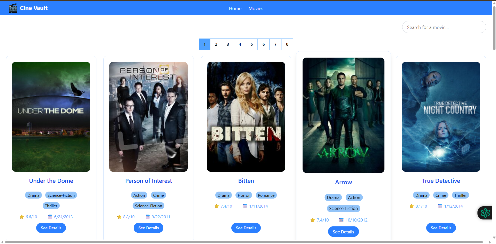

# 🚀 CineVault

<div align="center">


[](https://github.com/AlNahianFatin/CineVault/stargazers)

[](https://github.com/AlNahianFatin/CineVault/network)

[](https://github.com/AlNahianFatin/CineVault/issues)

[](LICENSE)

**A modern, feature-rich web application for exploring TV shows, powered by React and Vite.**

[Live Demo](https://cine-vault-sage-xi.vercel.app) 

</div>

## 📖 Overview

CineVault is a dynamic and interactive web application designed for TV show enthusiasts. It provides a seamless experience for discovering popular, trending, top-rated, and upcoming titles. Built with a robust React ecosystem, including Redux Toolkit for state management, `react-router-dom` for intuitive navigation, CineVault delivers a modern and engaging user interface. The application leverages a clean and responsive design, ensuring an optimal viewing experience across various devices.

## ✨ Features

-   🎯 **Extensive TV Show Discovery:** Browse and search for a vast collection of TV shows.
-   🔍 **Advanced Filtering & Search:** Easily find content by tv show name.
-   📺 **Detailed Content Pages:** View comprehensive information including name, release date, ratings, and description.
-   📱 **Responsive Design:** Optimized for seamless viewing on desktops, tablets, and mobile devices, thanks to Tailwind CSS, daisyUI and Styled Components.
-   🔄 **Centralized State Management:** Efficient data handling with Redux Toolkit for consistent application state.
-   🛣️ **Client-Side Routing:** Fast and dynamic page navigation using `react-router-dom`.
-   🖼️ **Image Galleries:** Showcase show posters, and backdrops.

## 🖥️ Screenshots

### Home Page



### TV Show Details



## 🛠️ Tech Stack

**Frontend:**

[](https://react.dev/)

[](https://vitejs.dev/)

[](https://reactrouter.com/)

[](https://tailwindcss.com/)

[](https://react-icons.github.io/react-icons/)

**DevOps & Tools:**

[](https://eslint.org/)

[](https://prettier.io/)

[](https://vercel.com/)

## 🚀 Quick Start

Follow these steps to get CineVault up and running on your local machine.

### Prerequisites
-   **Node.js**: `^18.0.0` or higher (as per Vite's typical requirements for modern Node.js versions).
-   **npm**: Comes with Node.js.

### Installation

1.  **Clone the repository**
    ```bash
    git clone https://github.com/AlNahianFatin/CineVault.git
    cd CineVault
    ```

2.  **Install dependencies**
    ```bash
    npm install
    ```

3.  **Start development server**
    ```bash
    npm run dev
    ```

4.  **Open your browser**
    Visit `http://localhost:5173` (or the port indicated in your terminal) to see the application running.

## 📁 Project Structure

```
CineVault/
├── public/                 # Static assets (e.g., favicon, logo)
├── src/                    # Main application source code
│   ├── assets/             # Images, fonts, other static files
│   ├── components/         # Reusable UI components
│   ├── hooks/              # Custom React hooks
│   ├── pages/              # Top-level components representing distinct views/routes
│   ├── redux/              # Redux slices and store configuration
│   ├── styles/             # Global styles, Tailwind CSS configuration
│   ├── utils/              # Utility functions and helpers
│   └── main.jsx            # Main entry file for the React application
├── .gitignore              # Specifies intentionally untracked files to ignore
├── eslint.config.js        # ESLint configuration for code quality
├── index.html              # Main HTML file serving the React app
├── package-lock.json       # Records the exact dependency tree
├── package.json            # Project metadata and script commands
├── vercel.json             # Configuration for Vercel deployment
└── vite.config.js          # Vite build tool configuration
```

## 🔧 Development

### Available Scripts
In the project directory, you can run:

| Command | Description |

|---------|-------------|

| `npm run dev` | Starts the development server with Vite. |

| `npm run build` | Builds the app for production to the `dist` folder. |

| `npm run lint` | Runs ESLint to check for code quality issues. |

| `npm run preview` | Serves the production build locally for testing. |

### Development Workflow
1.  Ensure prerequisites and installation steps are completed.
2.  Run `npm run dev` to start the development server.
3.  Any changes saved in the `src` directory will trigger a hot reload in your browser.
4.  Use `npm run lint` to check code style and potential errors.

## 🧪 Testing

There are no explicit test files or configurations (like Jest or React Testing Library) detected in the provided file list.
<!-- TODO: If testing framework is added, update this section with relevant commands and setup. -->

## 🚀 Deployment

This project is configured for deployment with [Vercel](https://vercel.com/).

### Production Build
To create a production-ready build:
```bash
npm run build
```
This command generates static assets in the `dist` directory.

### Deployment Options
-   **Vercel**: The `vercel.json` file indicates that this project can be deployed directly to Vercel. Connect your GitHub repository to Vercel, and it will automatically detect the configuration and deploy your application.
    [](https://vercel.com/new/clone?repository-url=https%3A%2F%2Fgithub.com%2FAlNahianFatin%2FCineVault)
-   **Static Hosting**: The `dist` folder generated by `npm run build` can be deployed to any static hosting service (e.g., Netlify, GitHub Pages, Firebase Hosting).

## 🤝 Contributing

We welcome contributions to CineVault! If you have suggestions, bug reports, or want to contribute code, please follow these steps:

1.  Fork the repository.
2.  Create a new branch (`git checkout -b feature/your-feature-name` or `bugfix/issue-description`).
3.  Make your changes and ensure your code adheres to the project's coding standards (run `npm run lint`).
4.  Commit your changes (`git commit -m 'feat: Add new feature'` or `fix: Resolve bug`).
5.  Push to the branch (`git push origin feature/your-feature-name`).
6.  Open a Pull Request to the `main` branch.

## 📄 License

This project is licensed under the MIT License - see the [LICENSE](LICENSE) file for details. <!-- TODO: Create a LICENSE file with MIT License content. -->

## 🙏 Acknowledgments

-   **The Movie Database (TMDB)** for providing a comprehensive API for movie and TV show data. <!-- Assuming TMDB is the API source based on common practice for such apps. -->
-   All the open-source libraries and tools that made this project possible.

## 📞 Support & Contact

-   📧 Email: [alnahianfatin7@gmail.com] <!-- TODO: Confirm actual contact email for AlNahianFatin -->
-   🐛 Issues: [GitHub Issues](https://github.com/AlNahianFatin/CineVault/issues)

---

<div align="center">

**⭐ Star this repo if you find it helpful!**

Made with ❤️ by [AlNahian Fatin](https://github.com/AlNahianFatin)

</div>

